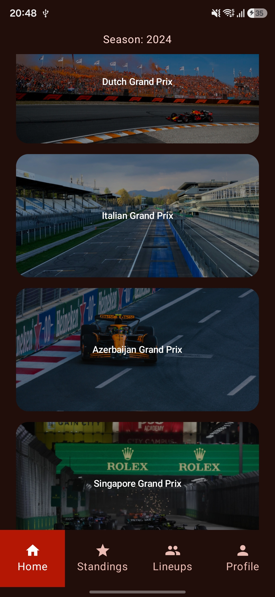
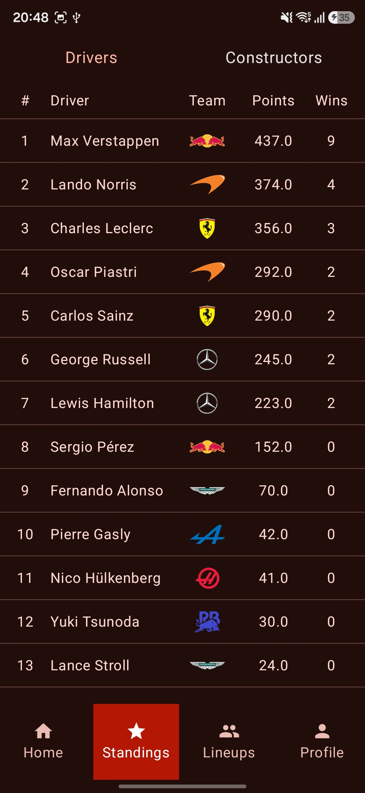
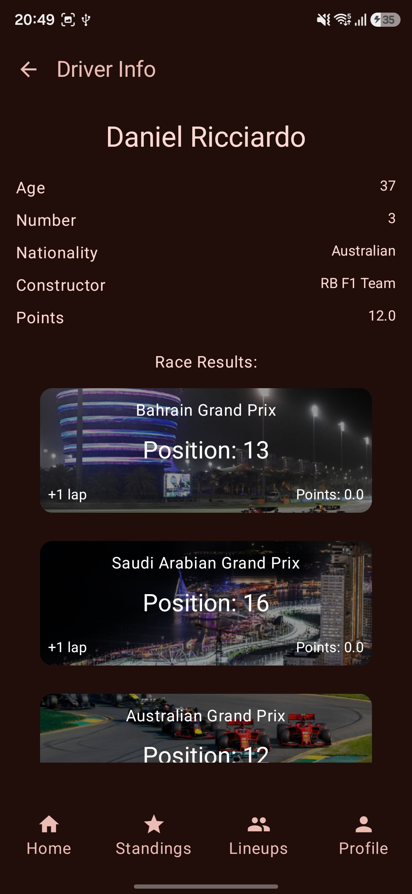
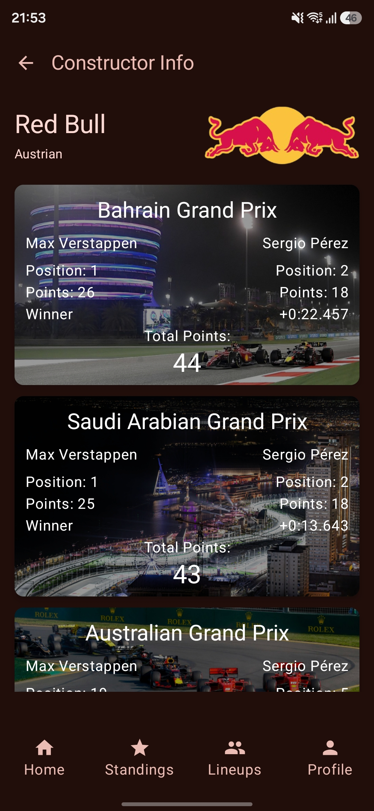
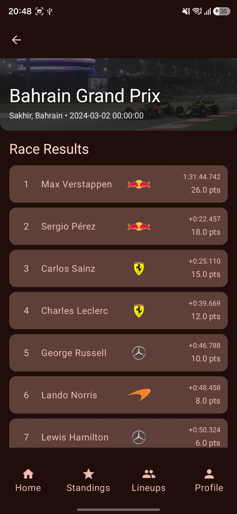

# F1 Mobile App

Kotlin Android application for tracking Formula 1.

## About

This is an Android application built with Kotlin and Jetpack Compose to provide F1 data. It features real-time tracking of race schedules, championship standings, and detailed information about drivers and constructors. The app interacts with a custom Flask backend to display Formula 1 statistics.

## Features

- Complete F1 season schedule with information about each race.
- Real-time driver and constructor championship standings.
- In-depth information for every driver and team on the grid.
- User accounts with Login and Registration functionality.
- Personalized experience with light and dark mode.

## Tech Stack

- Kotlin + Jetpack Compose
- Hilt (Dagger), Retrofit, OkHttpCoil, Compose Navigation and others
- MVVM (Model-View-ViewModel)
- Custom Flask API

## Screenshots

| Schedule                                  | Standings | Driver | Team | Race |
|-------------------------------------------|-----------|--------|------|------|
|  |  |  |  |  |

## Demo

https://github.com/user-attachments/assets/7f31c63b-feaa-4ef3-b55b-09f5515f9c1d
